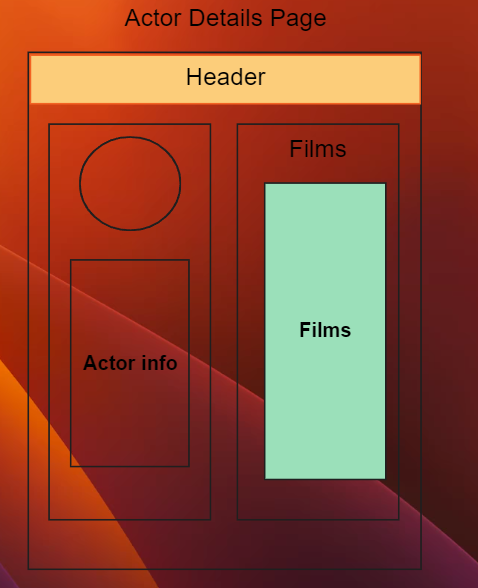

# Film Rental Project Documentation

**Project Functions**

+ Actors list page (home page).
    - All actors list (Table. Columns: id, FullName)
    - Search by first name/last name.
    - Clickable names (link -> Actor Details).
+ Actor details page. 
    - Actor details block. (default photo?, first/last names, ??)
    - Film block list with THIS actor
        * Title
        * Release Year
        * Short Description (limited to 50/100 symbols with "read more")
+ Film details page.
    - Title
    - Full actors
    - Film category
    - Full description
    - Language
    - Release year
    - Prices
    - Stores info where available
    - Iventory count
    - Last rented date (?)
    - ir visa kita, ka tik sugalvosim...

1. Composer (Namespace, Autoloader. etc.) +
2. .htaccess config // test index.php routing +
3. src dir structure +
4. Assets,Views,Service,Repository,Framework,Controller +
5. Create DI Container, Router. Add to index.php +
6. Connect Database +
7. Create Routes (/, /actor, /movie, default:404) +
8. Controllers
9. Services
10. Repositories
11. Views (composer->smarty, assets, css, js)
12. Have Fun!